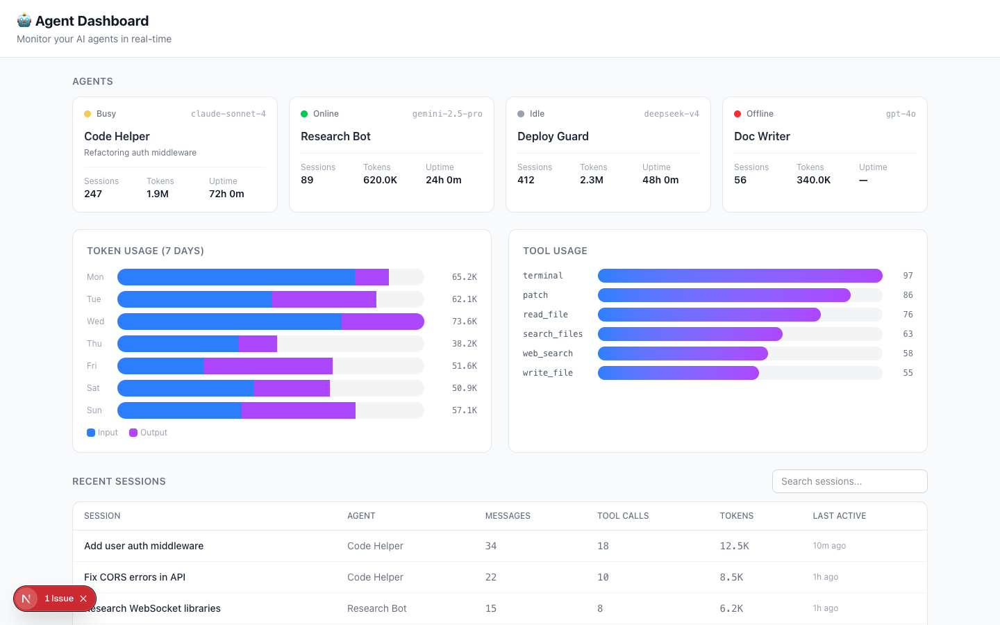

# Agent Dashboard 🤖

A real-time monitoring dashboard for AI agents — track token usage, tool calls, session history, and agent status at a glance.



## ✨ Features

- **Agent Status Cards** — Online/Busy/Idle/Offline with model, sessions, tokens, uptime
- **Token Usage Charts** — 7-day input/output token breakdown with visual bars
- **Tool Usage Analytics** — Frequency distribution across all tool types
- **Session Table** — Searchable, filterable session history with full metrics
- **Agent Filtering** — Click any agent card to filter sessions by agent
- **Dark Mode** — System-aware theme
- **Zero API Dependencies** — All data is demo-generated; plug in your own API

## 🚀 Quick Start

```bash
git clone https://github.com/TeddyBobby/agent-dashboard.git
cd agent-dashboard
npm install
npm run dev
```

Open [http://localhost:3000](http://localhost:3000).

## 🔌 Integrating Your Own Data

Replace the demo data generators in `src/lib/types.ts` with your API calls:

```typescript
// Instead of:
const [agents] = useState(() => generateDemoAgents());

// Use:
useEffect(() => {
  fetch('/api/agents').then(r => r.json()).then(setAgents);
}, []);
```

The dashboard is designed to work with any agent framework that exposes metrics — Hermes Agent, LangChain, AutoGPT, etc.

## 📊 Metrics Tracked

| Metric | Description |
|--------|-------------|
| Sessions | Total conversation sessions per agent |
| Tokens | Input + output token consumption |
| Tool Calls | Number of tool invocations |
| Uptime | Agent running time |
| Messages | Messages per session |
| Last Active | Time since last interaction |

## 🏗️ Tech Stack

| Layer | Technology |
|-------|-----------|
| Framework | Next.js 14 (App Router) |
| Language | TypeScript |
| Styling | Tailwind CSS |
| Charts | Custom CSS/SVG (no chart library) |
| State | React useState |

## 🤝 Contributing

PRs welcome! Open an issue first for major changes.

## 📄 License

MIT © [TeddyBobby](https://github.com/TeddyBobby)
